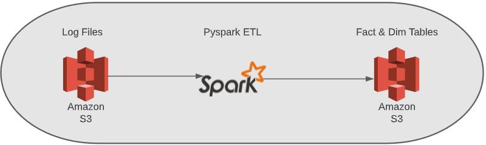
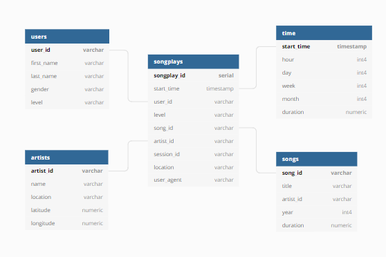

# Project 1: Data Lakes
 
This Data Lake ETL project from the Udacity Data Engineering nanodegree creates an etl job to run via spark to collect json logs from an example music app called Sparkify and convert them to usable tables.

The purpose of this project is to ingest the log data and complete all transformations within an etl script and export them to an s3 bucket in a usable fact and dimension format. 

`Note: To reproduce this on spark, please make sure your EMR role has access to s3.>`

## Config
d1.cfg is empty, to run this you need to enter the aws key and secret for a user that has S3 access.

d1.cg contains:

`KEY=YOUR_AWS_ACCESS_KEY
SECRET=YOUR_AWS_SECRET_KEY`

## ETL Pipeline
Step 1: Ingest data from s3
* Song data is located at: `s3://udacity-dend/song_data`
* Log data is located at: `s3://udacity-dend/log_data`

Step 2: Process the data in spark

* Ingest the two sets of files, Song data is transformed into the Dimesion tables "songs" and "artists".

* Log data is transformed into dimension tables "users" and "time"

* The Fact table "songplays" is created by a join between the Log and Song data on the name of the song and timestamp.

Step 3: Export to S3
* Write the new tables back to S3 in the new format as partitioned parquet files.

`Note: The best way to use the exported tables is in format of the star schema below.>`
