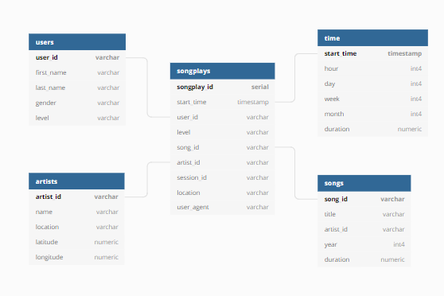

# Project 1: Data Modeling with Postgres
 
This relational modelling project from the Udacity Data Engineering nanodegree creates a postgres database for an example music app called Sparkify.

The purpose of this project is to first model and create a star schema for song play analysis using json log files. 

>Note: To reproduce this locally, postgresql must be installed and a student user with matching password must have the ability to create a database.

## Star Schema Design
The star schema has one fact table: "songplays", and four dimensions:"users", "artists", "songs" and "time". The queries to drop, create and insert the the data into the tables is contained within sql_queries.py.

This design allows easy reporting on all areas within the data with each dimension being linked to the songplays table you can easily match artist and user info and report on the portfolio of music subscriptions. 

>created on dbdiagram.io

## Scripts
The  create_tables.py script firstly drops the tables and database, before recreating the database and tables for the star schema via the scripts in sql_queries.py. 

The etl.py script incrementally extracts the data from the song files, transforms that data and then inserts it into the songs and artists tables via sql_queries.py.

The script then extracts and processes the json from the log file to insert into the time and users tables via sql_queries.py.

The last step of the etl process is then creating the fact table, which involves select query which combines the log file data with the song data to get the information required by matching artist name, song name and song duration. 

>Note: The etl.py script must be run after create_tables.py

## Example queries:

Simple count of users in each level

`SELECT level, COUNT(level) as UserCount FROM users group by level;`

Count of times an artist is played(Elena as example)

`SELECT count(songplay_id) from songplays join artists on songplays.artist_id =artists.artist_id where artists."name"  = 'Elena'`